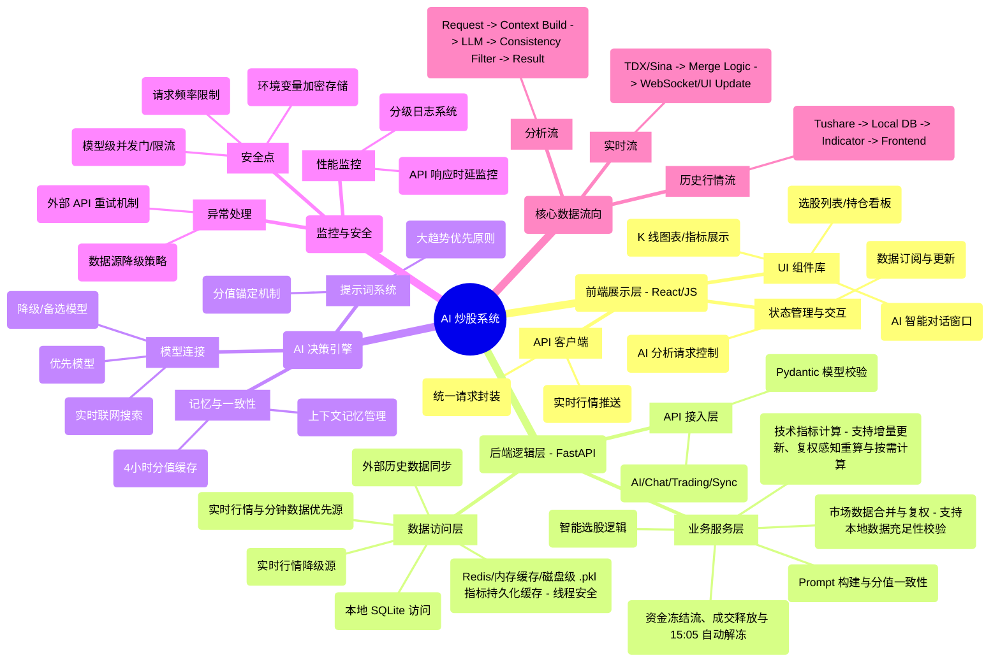

# AI 炒股系统架构思维导图 (System Architecture Mindmap)

> **使用说明**：
> 1. **可视化预览**：本文件中的 Mermaid 代码块在支持 Mermaid 的编辑器（如 Trae, VS Code）中可直接显示。
> 2. **导入 XMind**：复制下方的“结构化大纲”部分，保存为 `.md` 文件，在 XMind 中选择 `文件 -> 导入 -> Markdown` 即可生成思维导图。

---

## 1. Mermaid 可视化思维导图

---

## 2. 结构化大纲 (可导入 XMind)

### AI 炒股系统架构
- **1. 前端展示层 (React + JavaScript)**
  - **核心组件**
    - K 线图表展示 (基于轻量化图表库)
    - AI 智能对话交互界面
    - 选股结果与策略看板
  - **交互逻辑**
    - 数据订阅 Hook (实时合并行情)
    - AI 分析异步请求处理
  - **通讯协议**
    - RESTful API (业务请求)
    - WebSocket (实时秒级行情)

- **2. 后端核心层 (FastAPI)**
  - **API 路由层**
    - `ai_endpoints`: 统一 AI 分析入口
    - `trading_endpoints`: 交易指令下达
    - `endpoints`: K 线/实时行情/选股等市场查询入口
    - `chat_endpoints`: AI 对话入口 (统一上下文 + 限流)
  - **业务服务层**
    - `MarketDataService`: 处理 5 年历史限制与前复权逻辑，支持主要指数同步
    - `AnalysisService`: 处理分值偏差 (±15分) 与一致性检查
    - `IndicatorService`: 计算 MACD, KDJ, MA 等核心指标，支持增量更新、复权感知重算与按需计算
    - `ReviewService`: 午间/收盘复盘、市场温度与连板梯队、次日计划生成（详见 [backend/docs/REVIEW_ENGINE.md](backend/docs/REVIEW_ENGINE.md)）
  - **数据存储层**
    - 本地数据库 (缓存 K 线与分析结果)
    - Tushare API (官方历史数据源)
    - TDX/Sina (实时行情优先/降级)
    - 指标持久化层 (磁盘快照，秒级加载)

- **3. AI 决策引擎 (智能大脑)**
  - **提示词工程**
    - 趋势优先原则 (月/周 > 日)
    - 复杂形态识别 (放量上影线处理)
  - **一致性管理**
    - `_score_consistency_cache`: 4 小时内评分稳定性
    - `prev_score`: 上下文感知分析
  - **模型接入**
    - 联网搜索增强 (Search Service，可选)
    - MiMo/DeepSeek 双模型容错 (优先 MiMo，失败或限流时自动降级)
    - 深度研报分析逻辑

- **4. 安全、监控与异常处理**
  - **安全控制**
    - 敏感密钥环境变量隔离
    - 输入参数 Pydantic 强制校验
  - **系统监控**
    - 分级日志记录 (DEBUG/INFO/ERROR)
    - 异步并发性能优化 (asyncio.gather)
  - **异常分支**
    - 数据缺失时的填充兜底 (fallback)
    - 网络超时重试机制

- **5. 关键业务流**
  - **实时行情流**: 获取实时快照 -> 合并至最后一根 K 线 -> 鲁棒校验 -> 推送前端
  - **选股决策流**: 基础筛选 -> 技术指标计算 -> AI 上下文构建 -> LLM 评分 -> 结果持久化
