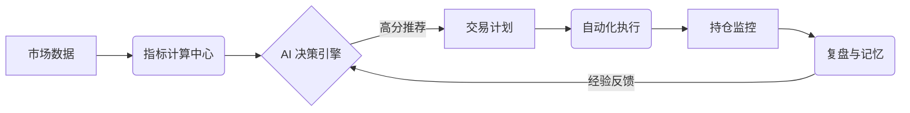

# 木偶说 AI 交易系统：打造大师级 AI 游资操盘手

> **核心愿景**：通过 AI 驱动的深度洞察与量化执行，构建一个具备自我进化、长期记忆、风险可控的 7x24 小时全自动智能交易系统。

---

## 🌟 系统概述

**木偶说 AI 交易系统** 是一套专为专业投资者设计的“AI 游资操盘手”解决方案。它不只是简单的量化脚本，而是一个融合了 **大语言模型 (LLM)** 的逻辑推理能力与 **量化交易系统** 的严谨执行力的智能化交易闭环。

系统模拟顶级游资的决策路径：从盘后深度复盘、板块热度分析、唯一标的锁定到交易计划制定与自动化执行，每一环节都由 AI 深度参与并进行自我修正。

---

## 🚀 核心功能亮点

### 1. 🧠 AI 智能决策大脑
*   **多模型驱动**：深度集成 MiMo/DeepSeek 等 LLM，结合可选实时联网搜索 (Serper)，提供超越传统指标的情绪面与政策面分析。
*   **分值一致性逻辑**：首创 4 小时评分锚定机制，确保 AI 在复杂行情波动中保持决策的一致性，拒绝情绪化波动。
*   **深度复盘引擎**：每日自动生成市场温度快照、连板高度统计及板块轮动路径，捕捉“市场最强音”。
    *   复盘细节与接口说明见：[backend/docs/REVIEW_ENGINE.md](backend/docs/REVIEW_ENGINE.md)

### 2. 📊 工业级数据底座
*   **5年历史约束**：严格遵循 5 年历史数据生命线，兼顾性能与信息价值，拒绝冗余。
*   **全自动复权中心**：全系统统一前复权 (QFQ) 逻辑，动态锚定最新复权因子，确保均线 (MA) 与 MACD 等指标的绝对精确。
*   **秒级加载性能**：通过磁盘级指标快照持久化与 Pandas 矢量化计算，实现常用 K 线与指标的秒级呈现与刷新。

### 3. 🎯 智能选股与策略矩阵
*   **强势回调策略**：精准识别前期主升浪后的缩量回踩，定位 MA20/MA30 的二次起爆点。
*   **尾盘突击策略**：每日 14:45 自动扫描全场异动，博取次日溢价空间。
*   **多维评分体系**：从技术面、资金面、题材面进行 0-100 的全维度量化打分。

### 4. 🛡️ 交易闭环与系统健壮性
*   **账户感知执行**：AI 决策自动关联当前资金状况与持仓风险，实现动态仓位管理。
*   **全链路数据自愈**：内置多级数据校验机制，自动检测并修正 K 线断层、复权异常及指标偏差，确保决策依据的绝对可靠。
*   **任务监控中心**：实时追踪每一个定时任务的执行状态，具备毫秒级的心跳监控与异常自动清理功能。
*   **严谨止盈止损**：每一份交易计划均包含明确的技术止损位与分批止盈目标，默认“风险优先”原则。

---

## 🛠️ 技术架构

系统采用现代化的全栈技术架构，确保高并发与低延迟：

*   **后端 (Backend)**: Python 3.10 + FastAPI (高性能异步) + SQLAlchemy (SQLite)
*   **前端 (Frontend)**: React 18 + Vite + Ant Design + ECharts/Lightweight Charts
*   **数据源 (Data)**: Tushare Pro (官方历史) + 通达信 TDX 实时行情 (优先) + Sina 降级
*   **AI 引擎**: MiMo/DeepSeek LLM + 可选搜索增强

---

## 📈 进化路线 (Evolution Roadmap)

*   **L1 辅助交易 (已完成)**: AI 选股，人工决策。
*   **L2 半自动交易 (已完成)**: AI 制定计划，自动买卖，人工监管。
*   **L3 数据闭环 (进行中)**: 自动收集胜负案例，建立 PatternLibrary 经验库。
*   **L4 长期记忆 (开发中)**: 基于向量数据库 (Vector DB) 的历史案例检索，实现 AI “老马识途”。
*   **L5 自我进化 (愿景)**: 每日自动跑批训练，优化 Prompt 与策略权重，实现无干预进化。

---

## 🖥️ 快速预览

### 系统完整性数据流

---

## 📜 结语

**木偶说 AI 交易系统** 致力于让每位投资者都拥有一名不眠不休、冷静客观、且能持续学习的“AI 游资合伙人”。

> **风险提示**：股市有风险，投资需谨慎。本系统仅供技术交流与研究使用，不构成任何投资建议。
